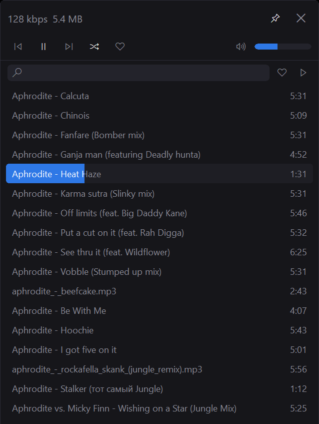

English | [Русский](README.ru.md)

# iliz MCP player

A simple, pleasant Windows player that is easy to use. One window: transport on top, queue below. Drop files or a folder and they are in the player.

The player is also an [MCP](https://modelcontextprotocol.io) server for AI agents. Cursor, Claude Code, and others can find a track, start it, like it, or skip ahead while the window sits in the tray.



## System

- Windows 10 / 11 (x64)
- No installer: unpack and run
- A second launch does not open a copy: files on the command line go to the player that is already running

Playback via [BASS](https://www.un4seen.com/): MP3, WAV, OGG, AIFF, and other built-in formats.

Queue, likes, play counts, and the search index live in `%APPDATA%\iliz\iliz_mcp_player\library.db`.

## Usage

Drop files or folders onto the window. If nothing is playing, the first added track starts on its own.

- Space — pause / resume. Enter — play the selection. Delete — remove from the queue.
- Arrows and Page Up / Page Down — move the selection. Left / Right — seek by 5 seconds.
- Click the bar to seek. Scroll on the volume control to change it; click the speaker to mute.
- Heart or Ctrl+L — like. Next to it: liked-only and already-played filters.
- The search box filters the queue by title. Ctrl+A selects the visible rows. Ctrl+click and Shift+click select several.
- Shuffle, and keep the window above others.
- Media keys (play/pause, next, previous, stop) work from the tray too.
- Esc or the close button hides the window. Ctrl+click the close button to exit.
- Click the tray icon to show the window. Double-click to pause or resume. Right-click: show, open the data folder, about, exit.
- Right-click a track: copy the title, tags, remove from the queue, or delete the file from disk.

## MCP

The player is the MCP server. Start it first, then point the agent at the URL. The client does not launch the player: this is not a stdio process.

While the player is running it listens on localhost only:

`http://127.0.0.1:17321/mcp`

Cursor, Claude Desktop, Claude Code, MCP Inspector — user MCP config:

```json
{
  "mcpServers": {
    "iliz-player": {
      "url": "http://127.0.0.1:17321/mcp"
    }
  }
}
```

If the client wants an explicit transport, add `"type": "http"` next to `url`.

Tools match REST. Call `play` with an `id` from `search`. Errors come back as `isError` with the same `error` strings as HTTP.

| Tool | Arguments | What it does |
| --- | --- | --- |
| `search` | `query` | Find by title, artist, album, or file name. An empty query lists the queue, at most 50. It does not change the search box in the window. |
| `now` | — | What is playing: `playing`, `paused`, or `stopped`, plus title, artist, and position. Does not change playback. |
| `play` | `id`, `query` | Start a track. `id` wins; `query` plays the first hit. This is not pause. |
| `skip` | `dir` | Next or previous track in the queue. `dir` is `next` (default) or `prev`. With shuffle, next is random. Previous restarts the current track if more than 3 seconds have passed. |
| `like` | `id`, `liked` | Like. Omit `id` for the current track. `liked` 1 or 0 sets it; omit `liked` to toggle. |
| `stop` | — | Stop and clear the current track. This is not pause. |

A typical agent flow: `now` or `search`, take an `id`, then `play`, `skip`, `like`, `stop`.

The same API is plain HTTP, for example `http://127.0.0.1:17321/search?q=love`. Protocol, response fields, and errors are in [HTTP.md](HTTP.md).

## Build

Requires Visual Studio Build Tools 2022 (MSVC x64) and `bass.dll` in `bin\`.

```bat
build.bat
```

## Tests

Python 3, stdlib only. Build the player first (`bin\iliz_mcp_player.exe` and `bass.dll`).

```bat
python tests\test_player.py
```

The test starts its own player on a free `--port` and writes a temporary playlist under a separate `APPDATA`. Your queue is left alone. A player window flashes while the tests run.

New search cases are a `(query, titles)` row in `Search.test_table` in `tests\test_player.py`.

## Change it

The sources are in this repository and build with one `build.bat`. If something is missing — a button, a gesture, a tool for the agent — you can add it yourself in Claude Code, Cursor, or a similar editor: open the project and describe what should change.
